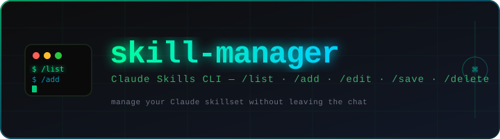

<div align="center">



<br/>

[](#skill-index)
[](#)
[](#what-is-a-skill)
[](#)

**A personal library of Claude skill files — modular instruction sets that enforce discipline,  
structured workflows, and hard-won best practices directly inside Claude.**

</div>

## ❓ What Is a Skill?

A skill is a `SKILL.md` file with YAML frontmatter that tells Claude when to activate and how to behave:

```yaml
---
name: elite-coder
description: >-
  Activates elite-level coding discipline. Trigger on "write a", "implement",
  "fix", "build", "refactor", or any request for code. When in doubt, apply this
  skill — precise coding is never the wrong call.
---
```
---

## Skill Index

### 🧠 Core Development

| Skill | One-liner |
|---|---|
| [`elite-coder`](./elite-coder/SKILL.md) | Three mandatory gates before any code is written — no stubs, no placeholders, ever |
| [`coding-typescript`](./coding-typescript/SKILL.md) | TypeScript, React, Node.js standards: type safety, error handling, React patterns |
| [`search-first`](./search-first/SKILL.md) | Research pass enforced before writing non-trivial code |

### 🔍 Code Quality & Testing

| Skill | One-liner |
|---|---|
| [`ai-code-review-assistant`](./ai-code-review-assistant/SKILL.md) | Structured expert review: 🔴 Critical → 🟠 High → 🟡 Medium → 🔵 Low, every time |
| [`ai-regression-testing`](./ai-regression-testing/SKILL.md) | Testing for AI-assisted dev — catches the blind spots the model gives itself |
| [`python-testing`](./python-testing/SKILL.md) | pytest patterns: fixtures, mocking, parametrization, async, TDD cycle |
| [`verification-loop`](./verification-loop/SKILL.md) | 6-phase pre-PR gate: build → types → lint → tests → security → diff |

### ☁️ Infrastructure & Deployment

| Skill | One-liner |
|---|---|
| [`docker-patterns`](./docker-patterns/SKILL.md) | Dockerfiles and Compose: non-root by default, pinned tags, no secrets in layers |
| [`production-deployment`](./production-deployment/SKILL.md) | CI/CD, deployment strategies, health checks, zero-downtime migrations |
| [`cloud-infrastructure-security`](./cloud-infrastructure-security/SKILL.md) | IAM, secrets, IaC security, pre-deploy checklist across AWS / Vercel / Railway |

### 🤖 AI / ML

| Skill | One-liner |
|---|---|
| [`pytorch-patterns`](./pytorch-patterns/SKILL.md) | Device-agnostic training pipelines, AMP, reproducibility, fine-tuning |
| [`regex-vs-llm-structured-text`](./regex-vs-llm-structured-text/SKILL.md) | Regex handles 95–98% of structured text cheaply — LLMs for edge cases only |

### 🔌 APIs & Integrations

| Skill | One-liner |
|---|---|
| [`api-design`](./api-design/SKILL.md) | REST conventions: naming, status codes, pagination, versioning, rate limiting |
| [`x-api`](./x-api/SKILL.md) | X/Twitter API: OAuth, posting, searching, streaming, rate limit handling |
| [`data-scraper-agent`](./data-scraper-agent/SKILL.md) | AI-powered scraper agents: scheduled, LLM-enriched, free stack on GitHub Actions |

### 🧭 Project Intelligence

| Skill | One-liner |
|---|---|
| [`warmstart`](./warmstart/SKILL.md) | Session re-orientation: git state, recent changes, stack, prior learnings |
| [`codebase-onboarding`](./codebase-onboarding/SKILL.md) | Architecture map + `CLAUDE.md` generator for unfamiliar repos |
| [`self-improving-agent-v2`](./self-improving-agent-v2/SKILL.md) | Records failures and discoveries; retrieves them before similar tasks |

### 🔐 Security & Research

| Skill | One-liner |
|---|---|
| [`security-review`](./security-review/SKILL.md) | Web app security: secrets, XSS, CSRF, SQL injection, auth, headers |
| [`market-research`](./market-research/SKILL.md) | TAM/SAM, competitor maps, due diligence — decision-first, source-attributed |
| [`article-writing`](./article-writing/SKILL.md) | Long-form content with voice capture, quality gates, and a banned-filler list |

### 🛠️ Skill System

| Skill | One-liner |
|---|---|
| [`skill-manager`](./skill-manager/SKILL.md) | ⭐ The CLI. `/list` `/add` `/edit` `/save` `/delete` — manage everything in-chat |

---

## Installation

```bash
# Option A: paste SKILL.md into Claude, then:
/add

# Option B: upload a .skill or .zip file, then:
/add
```

---

<div align="center">

---

*Crafted by* **Yog-Sotho** — *the one who stares into the void of the terminal,  
and the terminal `/list`s back* 🐙

</div>
